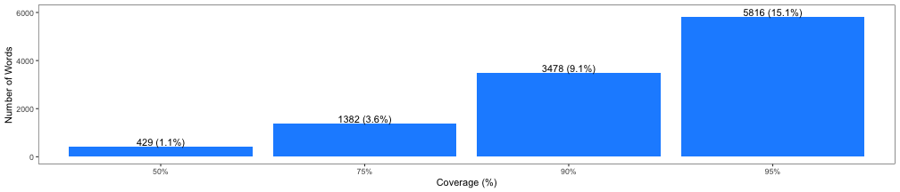

## The Goal

The <b>Word Prediction App</b> will predict up to 6 words based on the 
last words of a sentence. 

At least 1 <b>main word</b> must be present and the prediction context consists 
of up to the last 3 main words of the sentence.

A <b>main word</b> is a word that is not a stop word, not profane or misspelled
and within the 95% word coverage of all the words in the corpus.

The prediction algorithm used as data set a corpus of 3 documents, 4.269.678 sentences and 
102.081.616 words scraped from the Internet, i.e. from blogs, news sites and twitter.

```
wc -l -w -c final/en_US/*.txt
  899288 37334690 210160014 en_US.blogs.txt
 1010242 34372720 205811889 en_US.news.txt
 2360148 30374206 167105338 en_US.twitter.txt
 4269678 102081616 583077241 total
```

<span style="font-size:75%;">The complete R code can be found 
[here on GitHub](https://github.com/kristiaan67/CourseraCapstoneProject) .</span>

--- .class #id 

## The Prediction Data

First the original corpus was cleaned: i.e. its content converted to ASCII, punctuation
and numbers removed and white space stripped. Furthermore stop words, profane language, 
misspelled words and some patterns (URLs, email addresses, word and character repeats) 
were removed. The cleaned sentences were finally stemmed and the corpus saved.

Second the corpus was analyzed and the main outcome was <b>the list of main words</b>, 
based on their frequency. The main words are all the words that make up <b>95%</b> 
of all words in the corpus.


The text analysis shows that to <b>cover 95%</b> only <b>5816 words (15.1%)</b> of
all words are relevant.



<span style="font-size:75%;">The data cleaning and analysis process is described 
[in detail here](https://rpubs.com/kristiaan67/capstone_milestone_report).</span>


--- .class #id 

## The Prediction Model

For the prediction model <b>2-, 3- and 4-gram tables</b> were generated out of the cleaned
corpus and a lookup table was built using the last word as prediction and the
preceding words as context. To reduce the lookup tables a ngram entry was only kept
if the prediction is and the context contains at least one main word. 
The lookup tables are saved to CSV files.

The prediction algorithm cleans the input sentence, retrieves up to the last 3
main words (the context) and retrieves the 6 best matches starting with the 4-gram, 
then the 3-gram and finally the 2-gram tables.


```
        context prediction compl_prediction freq ngram
1: happi mother        day              day 2806     3
2:       let us       know             know 2708     3
3:    happi new       year             year 1834     3
4:     two year        ago              ago 1594     3
5: look forward        see              see 1593     3
6:     new year        eve             even  932     3
```
<span style="font-size:75%;">An example of the lookup table with a context of 2 words (3-gram table)</span>

--- .class #id 

## The Word Prediction App

The App in action
([Link to the App on shinyapps.io](https://kdejongh.shinyapps.io/word_prediction_app/)):

<iframe src="https://kdejongh.shinyapps.io/word_prediction_app/" style="height: 450px; margin-top: 0; border: 1px solid black;">
[Link to the App on shinyapps.io](https://kdejongh.shinyapps.io/word_prediction_app/)
</iframe>

